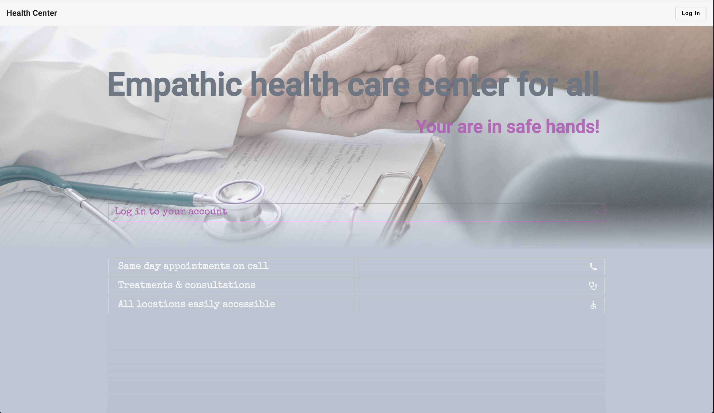

### Introduction

This repository contains Angular front end for a professional portfolio project "Health Center". 

"Health Center" application supports three user roles with different features for each scope: patient access provides features centuring around maintaining appointments and accessing medical records; for doctors, besides handling appointment bookings and creating medical records, the application provides calendar notifications about upcoming appointments as well as real-time notifications on incoming messages in the chat with admin or, patients creating new appointment request, or, patients canceling confirmed appointment; admin user role besides the chat, provides functionalities related to managing appointments on patient's behalf and activating doctors accounts.

This repository is deployed via [Vercel](https://app-fe-gamma.vercel.app/). 
[See user login credentials](#user-roles).
[Visit Health Center](https://app-fe-gamma.vercel.app/)
[See user login credentials](#user-roles).


___


### Table of Contents

- [Introduction](#introduction)
- [Table of Contents](#table-of-contents)
- [App Folder Structure](#app-folder-structure)
- [Libraries](#libraries)
- [User Features](#user-features)
  - [User roles](#user-roles)
      - [admin](#admin)
      - [doctor](#doctor)
      - [patient](#patient)

___

### App Folder Structure

```
Root Folder
└── src
    └── / app
        ├── apollo.config.ts
        ├── app.routing.module.ts
        ├── app.component.ts
        ├── app.component.css
        ├── app.component.html
        ├── app.module.ts
        ├── / graphql
        │   ├── / appointment
        │   │   ├── appointment.component.ts
        │   │   ├── appointment.component.scss
        │   │   ├── appointment.component.html
        │   │   ├── appointment.input.ts
        │   │   ├── appointment.ts
        │   │   ├── / appointments
        │   │   │   ├── / appointments
        │   │   │   │   ├── appointments.component.ts
        │   │   │   │   ├── appointments.component.scss
        │   │   │   │   └── appointments.component.html
        │   │   │   └── / calendar
        │   │   │       ├── calendar.component.ts
        │   │   │       ├── calendar.component.scss
        │   │   │       └── calendar.component.html
        │   ├── / record
        │   │   ├── record.component.ts
        │   │   ├── record.component.scss
        │   │   ├── record.component.html
        │   │   ├── record.input.ts
        │   │   ├── record.ts
        │   │   └── / records
        │   │       ├── records.component.ts
        │   │       ├── records.component.scss
        │   │       └── records.component.html
        │   └── / user
        │       ├── user.component.ts
        │       ├── user.component.scss
        │       ├── user.component.html
        │       ├── user.input.ts
        │       ├── user.ts
        │       ├── doctor-request.ts
        │       ├── / patients
        │       │   ├── patients.component.ts
        │       │   ├── patients.component.scss
        │       │   └── patients.component.html
        │       └──  / users
        │           ├── patients.component.ts
        │           ├── patients.component.scss
        │           └── patients.component.html
        └── / shared
            ├── constants.ts
            ├── types.ts
            ├── / components
            │    ├── / app-accordion
            │    │   ├── app-accord.component.ts
            │    │   ├── app-accord.component.html
            │    │   └── app-accord.component.scss
            │    ├── / app-alert
            │    ├── / app-calendar
            │    ├── / app-confirm
            │    ├── / app-editor
            │    ├── / app-event
            │    ├── / app-home
            │    ├── / app-landing
            │    ├── / app-loading
            │    ├── / app-login
            │    └── / app-table
            ├── / modules
            │    └── graphql.module.ts
            └──  / services
                 ├── app-appointment.service.ts
                 ├── app-auth-guard.service.ts
                 ├── app-auth.service.ts
                 ├── app-graphql.service.ts
                 ├── app-tabs.service.ts
                 └── app-timer.service.ts

```


___

### Libraries

- [Angular Material]("https://material.angular.io")
- [apollo-angular]("https://www.npmjs.com/package/apollo-angular")
- [FullCalendar]("https://www.npmjs.com/package/fullcalendar")
- [ngx-editor]("https://www.npmjs.com/package/ngx-editor")
- [socket.io-client]("https://www.npmjs.com/package/socket.io-client")
  

### User Features


'*' marks features that trigger email notification. Doctor action sends notification to patient; patient action, or admin's action on patient's behalf, sends out email notification to doctor.

#### User roles

###### admin

- Login using email & password (_'admin@email.com'_, _'demo'_)
- View, update, delete own account
- View all doctors
- View all doctor requests
- View all patients 
- Delete, activate doctor account request
- On behalf of patient: create, update, *delete appointments 
- Contact doctors via live chat
  
###### doctor

- Login using Google authentication
- View, update, delete own account
- View appointment requests (if doctor has no appointments for that time, overlapping appointments are not visible), *accept appointment, *delete appointment request
- View, *update, *delete accepted appointments
- View, delete past appointments
- View, *create, update, delete medical records
- Contact admin via live chat
  
###### patient

- Login using eID Hub (FTN) bank authentication (_Signicat Sandbox_)
    [FTN demo credentials](https://developer.signicat.com/identity-methods/ftn/demo-ftn/)
- View, update, delete own account
- Create, *update, *delete appointments
- View own appointments requests
- View own accepted (upcoming) appointments
- View own past appointments
- View own medical records


